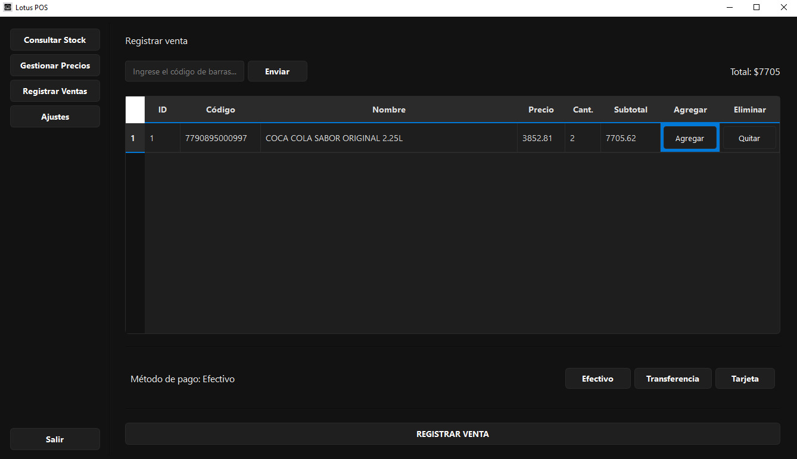

<p align="center">
  <a href="https://codecov.io/github/NehuenLian/Lotus-POS-Desktop">
    
  </a>
</p>


# Lotus POS | Point of sale system

**Lotus POS** is a desktop Point of Sale system designed for small and medium-sized businesses. It allows you to manage sales, inventory, pricing, and database configuration in a simple way.

## Main Features

- **Sales Management:** Fast sales registration, product selection by barcode, automatic total calculation, and payment method selection.
- **Inventory Control:** Instant stock lookup by product.
- **Price Management:** Search and update product prices.

---
<h3 align="center">Frontend screenshot</h3>
<p align="center">
  
  <br>
  <em>The screenshot shows the app in Spanish, as requested by a real client.</em>
</p>

---

## Architecture

```text
.
├── .github/
├── .pytest_cache/
├── docs/
├── images/
├── integration/
├── src/
│   ├── __pycache__/
│   ├── business_logic/
│   ├── controllers/
│   ├── data_access/
│   ├── logs/
│   ├── sample_data/
│   ├── utils/
│   ├── views/
│   └── exceptions.py
├── tests/
└── requirements.txt
```

---

## Installation

1. **Clone the repository:**
   ```bash
   git clone https://github.com/NehuenLian/Lotus-POS-Desktop
   ```

2. **Go to repository**
   ```bash
   cd Lotus-POS-Desktop
   ```

3. **Create and activate a virtual environment:**
   ```bash
   python -m venv venv
   source venv/bin/activate  # On Windows, use `venv\Scripts\activate`
   ```

4. **Install dependencies:**
   ```bash
   pip install -r requirements.txt
   ```

5. **Configure environment variables:**
   - Copy the `.env.example` file to `.env` and fill in the required values.
     ```
     # .env file
     DB_URL="sqlite:///src/data_access/sample_database.db"

     ```

---

## Usage

1. Run the application:
   ```bash
   python main.py
   ```

2. You can navigate through the sections from the sidebar:
   - **Stock Lookup**
   - **Price Management**
   - **Sales Registration**
   - **Settings**

---

## License

This project is licensed under the MIT license (a permissive open-source license).
You are free to use, copy, modify, and distribute the software, always including the copyright notice and without any warranties.

---

Author: Nehuen Lián https://github.com/NehuenLian